# 基于SpringBoot的论坛系统

<h4 style='color:red'>联系不到我，就看我的主页 </h4> 
 
#### 介绍

在当今数字化时代，论坛系统作为信息交流的重要平台，广泛应用于各种社区和组织的在线交流。本论坛系统是基于SpringBoot框架开发的，旨在提供一个高效、易用、多角色的交流平台。系统支持三种角色：管理端、版主端和用户端，每种角色拥有不同的权限和功能，以满足不同用户的需求。
随着互联网的迅速发展，传统论坛系统在某些方面已不能满足现代用户和管理者的需求。例如，管理效率低下、用户体验不佳、功能模块单一等问题逐渐显现。本研究旨在开发一个功能丰富、角色分明、易于管理的论坛系统，以解决现有论坛系统的局限性和问题。

#### 技术栈

后端技术栈：Springboot+Mysql+Maven

前端技术栈：Vue+Html+Css+Javascript+ElementUI

开发工具：Idea+Vscode+Navicate

#### 系统功能介绍

管理端功能模块  
个人中心：管理员可以查看和修改自己的个人信息。  
管理员管理：包括添加、删除、修改管理员账号，分配权限等功能。  
版主管理：对版主账号进行管理，包括添加、删除、修改版主信息及其权限。  
基础数据管理：管理论坛的基础数据，如分类、标签等。  
论坛管理：对论坛板块进行增删改查，管理论坛帖子和回复。  
留言版管理：管理用户留言，包括审核、删除留言等。  
新闻信息管理：发布、编辑和删除新闻信息。  
用户管理：查看、编辑、删除用户信息，管理用户权限。  

版主端功能模块  
论坛：版主可以管理自己负责的论坛板块，包括发帖、回帖、删帖等。  
留言版：管理用户在本板块下的留言。  
新闻信息：发布和编辑与板块相关的新闻信息。  
个人中心：查看和修改自己的个人信息。  
后台管理：  
论坛管理：管理自己负责的论坛板块。  
新闻信息管理：发布和编辑新闻信息。  

用户端功能模块  
论坛：用户可以浏览论坛帖子，发表新帖和回复。  
留言版：在留言版发表留言和查看其他用户的留言。  
新闻信息：浏览最新的新闻信息。  
个人中心：查看和修改自己的个人信息。  
后台管理：  
论坛管理：用户可以管理自己发表的帖子。  
留言版管理：管理自己的留言。  
新闻信息管理：用户可以提交新闻信息供版主或管理员审核。  

#### 系统作用

提升管理效率：通过角色分明的权限管理，管理员和版主可以更高效地管理论坛。

优化用户体验：用户端的功能设计注重易用性和互动性，提升了用户的参与感和满意度。

多功能集成：集成了论坛、留言版、新闻信息等多种功能模块，满足用户多样化的需求。

增强信息安全：通过严格的权限控制和数据管理，保障论坛的信息安全。

#### 系统功能截图

代码结构

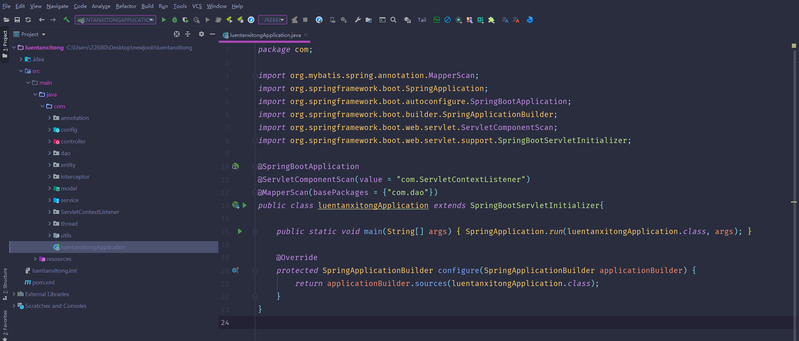

数据库表

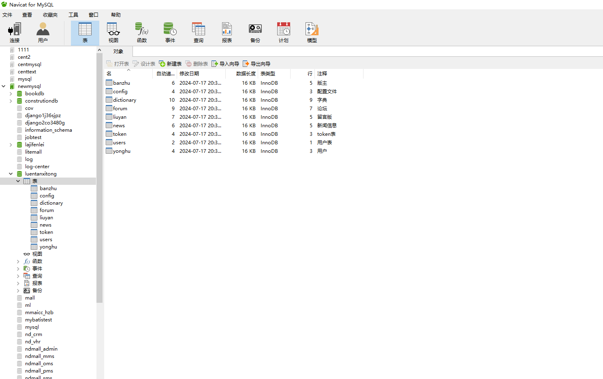

登录

前台页面首页

论坛模块

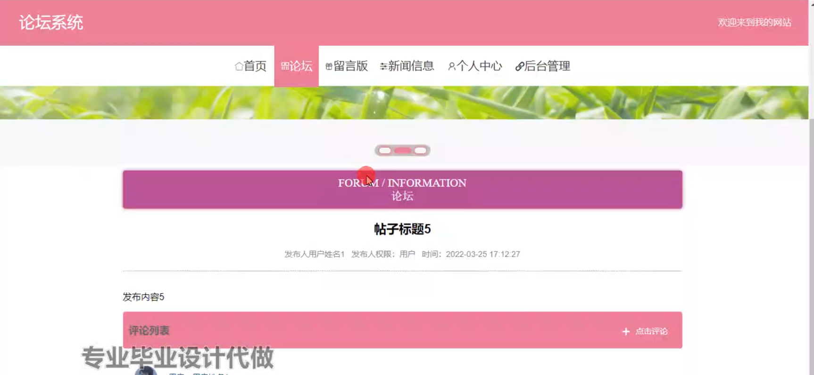

留言板模块

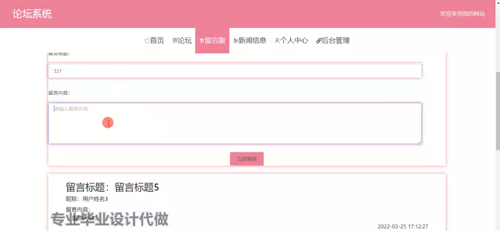

个人中心

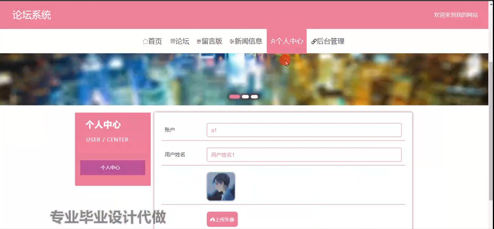

用户端后台管理

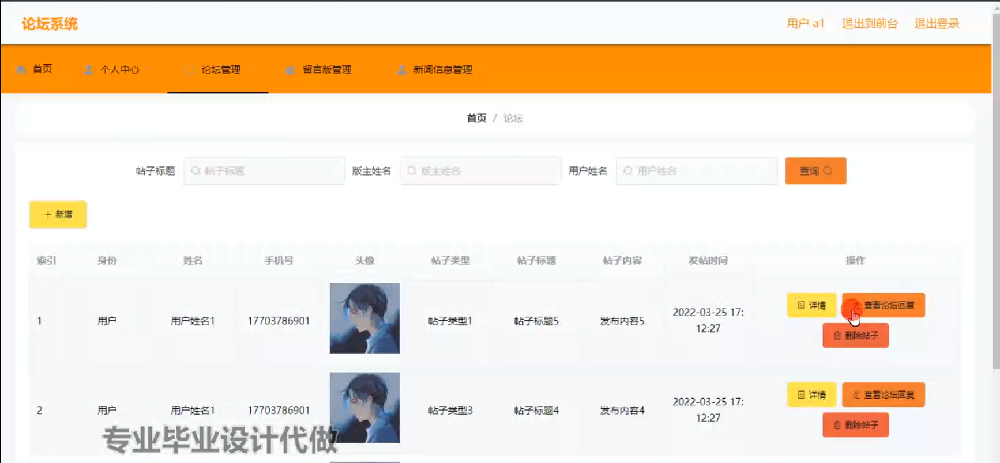

留言板管理

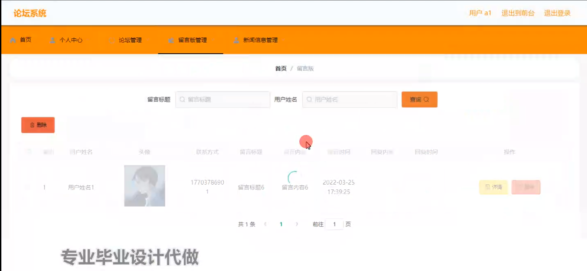

新闻信息管理

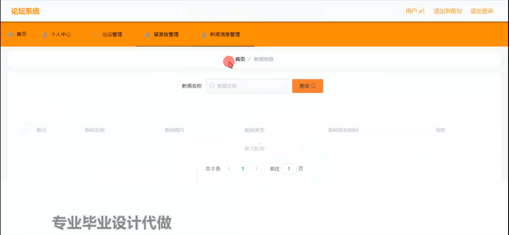

管理员端版主管理

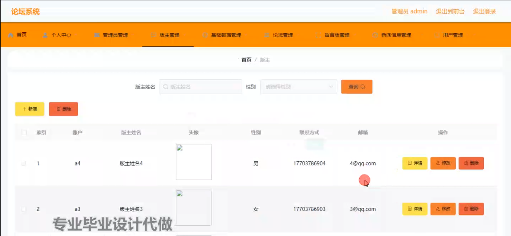

基础数据管理

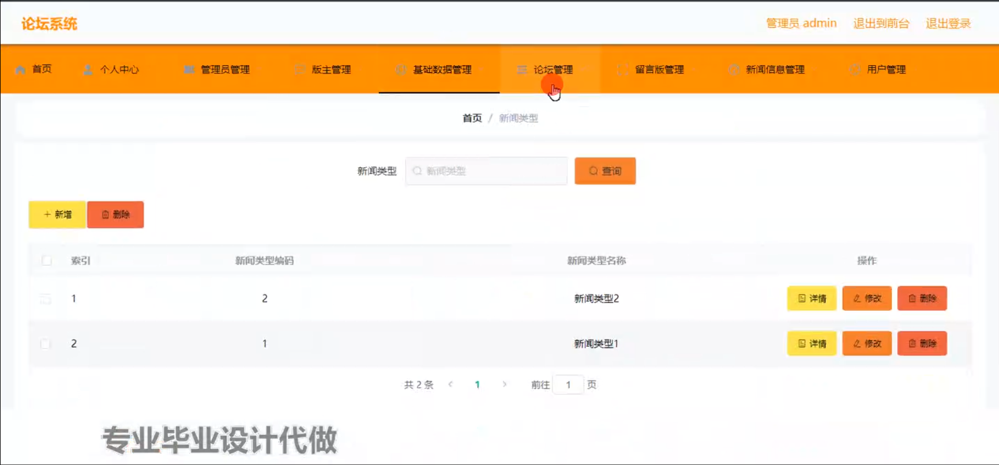

版主端新闻信息管理

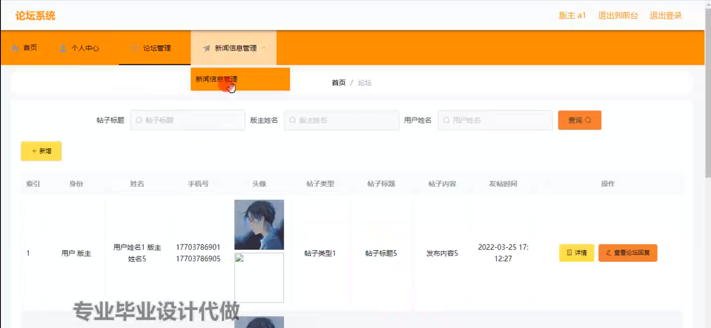

用户管理

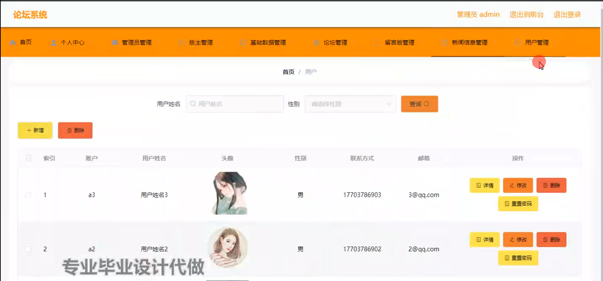

#### 总结

本研究基于SpringBoot框架开发了一个多角色的论坛系统，通过详细的需求分析和系统设计，实现了管理端、版主端和用户端的不同功能模块。该系统不仅解决了传统论坛系统在管理效率和用户体验方面的问题，还通过多功能集成增强了系统的实用性和用户粘性。
在未来的研究中，可以进一步优化系统的性能，提升用户体验，并探索更多创新功能，如引入人工智能技术进行内容审核和管理，以适应不断发展的互联网环境。本系统为论坛类应用的开发提供了新的思路和参考，具有一定的实际应用价值和学术意义。

#### 使用说明

创建数据库，执行数据库脚本 修改jdbc数据库连接参数 下载安装maven依赖jar 启动idea中的springboot项目

前台登录页面
http://localhost:8080/luentanxitong/front/index.html

后台登录页面
http://localhost:8080/luentanxitong/admin/dist/index.html

管理员				账户:admin 		密码：admin

版主				账户:a1 		密码：123456

用户				账户:a1 		密码：123456